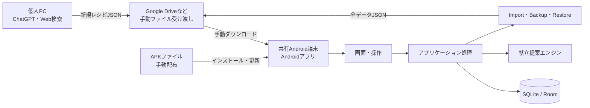
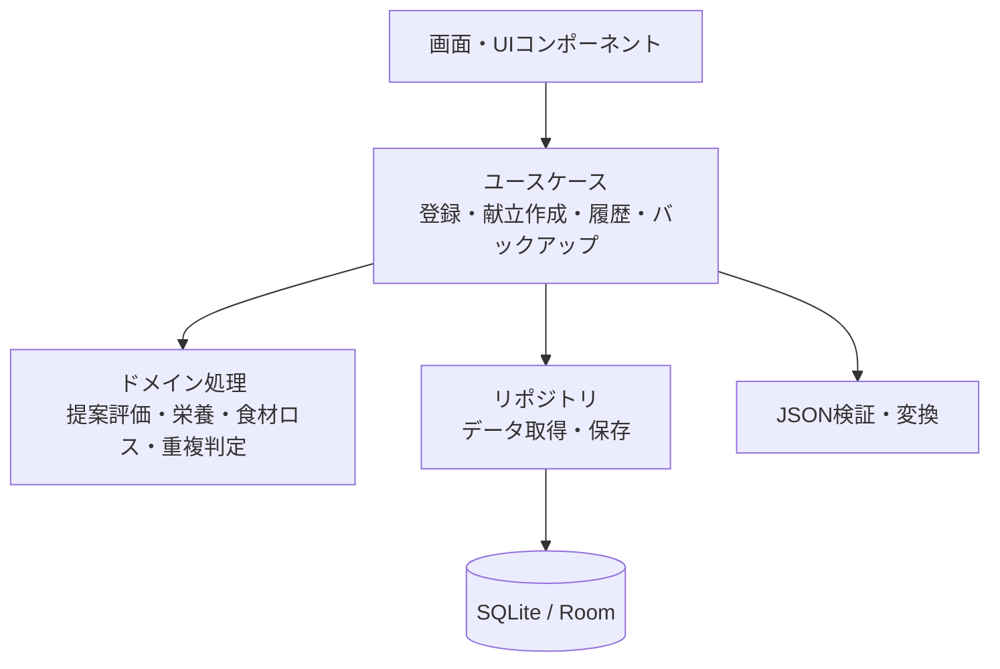
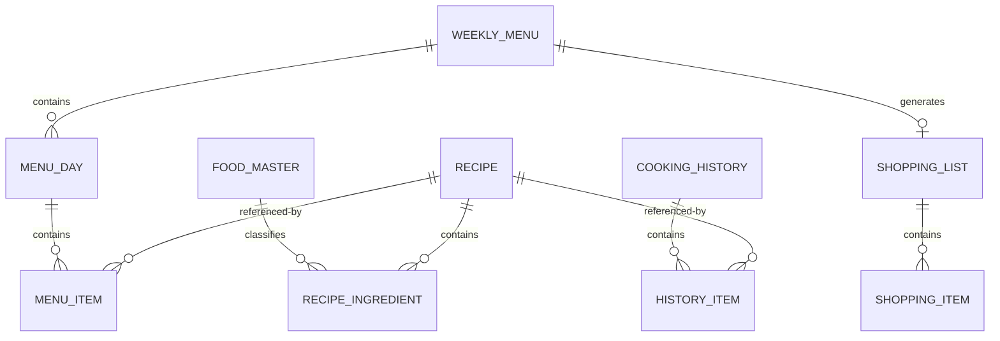

# レシピ管理アプリ 概要設計書

## 1. 文書情報

- 文書名: レシピ管理アプリ 概要設計書
- 対象工程: 概要設計
- 前提文書: `document/REQUIREMENTS.md`
- ステータス: 承認済み（Kotlin／Androidネイティブ版）

## 2. 設計方針

- 共有Android端末を唯一のデータ正本とする。
- アプリはKotlinで実装したAndroidネイティブアプリとして提供する。
- アプリ本体はAPKとして共有端末へインストールし、バックエンドサーバおよび外部データベースを使用しない。
- ユーザーデータは共有端末のアプリ専用領域にあるSQLiteデータベースだけに保存する。
- 個人PCは、ChatGPTなどで新規レシピ登録用JSONを作成する用途に限定する。
- Google DriveなどはJSONファイルの手動受け渡しにのみ使用し、API連携や自動同期は行わない。
- レシピの削除は論理削除とし、データ間の参照を維持する。
- バックアップおよび復元は全データを対象とする。

## 3. システム構成



### 3.1 配置方針

| 対象 | 配置先 | 内容 |
| --- | --- | --- |
| アプリ本体 | APKファイル | Kotlinコード、画面、内蔵マスター |
| 通常データ | 共有端末のアプリ専用SQLite | レシピ、献立、履歴、買い物リスト、設定など |
| 新規レシピ登録ファイル | Google Driveなど | 個人PCから共有端末へ渡す一時的なJSON |
| バックアップ | 共有端末およびGoogle Driveなど | 全データを含むJSON |

APKは`dst/`へ出力し、USB、Google Driveなどを介して共有端末へ手動で渡す。外部サービスにユーザーデータを保存しない。公開やGitHubへのPushは、ユーザーから明示的な指示を受けた場合だけ行う。

### 3.2 Androidでの導入・起動方法

- 開発PCで署名済みAPKを生成し、Google DriveやUSBなどで共有端末へ渡す。
- 初回はAndroid側で配布元に対する「不明なアプリのインストール」を一時的に許可し、APKを開いてインストールする。
- 通常はAndroidホーム画面またはアプリ一覧のアイコンから起動する。
- 更新版は同じアプリIDと署名鍵で作成し、既存アプリへ上書きインストールする。
- アプリ更新前、特にDB移行を伴う更新前には全データのバックアップを案内する。
- APKの取得以外の基本機能は、インターネット接続なしで利用できる。

### 3.3 アプリ更新・再インストール

- 同じアプリIDと署名鍵による上書き更新では、原則として端末内データを維持する。
- 署名鍵は初回リリース後に変更・紛失しないよう、安全に保管する。
- アプリをアンインストールするとアプリ専用領域のデータも削除されるため、アンインストール前に全データをバックアップする。
- アプリIDまたは署名鍵を変更する場合は別アプリとして扱われるため、旧アプリでバックアップし、新アプリで復元する。

## 4. 技術構成

| 区分 | 採用技術 | 採用理由 |
| --- | --- | --- |
| UI | Jetpack Compose + Material 3 | Kotlinで画面と状態を一貫して実装でき、Androidの操作体系に合わせやすい |
| 言語 | Kotlin | Android公式推奨言語で、型安全にデータと業務ロジックを扱える |
| ビルド | Gradle（Kotlin DSL） | Android公式のビルド、テスト、APK生成に対応する |
| 対応OS | Android 8.0（API 26）以上 | 共有端末との互換性を確保しつつ、現在のAndroid APIを利用しやすい |
| 画面遷移 | Navigation Compose | 戻る操作と画面遷移をAndroid標準の構成で管理できる |
| ローカルDB | SQLite + Room | 構造化データ、索引、トランザクション、DB移行を型安全に扱える |
| JSON処理 | kotlinx.serialization + Draft 2020-12対応JSON Schema検証ライブラリ | JSONの変換とSchema検証をKotlin側で実施する |
| 単体・DBテスト | JUnit + kotlinx-coroutines-test + Room Test | 献立評価、Import、復元、日付処理、DB処理を検証する |
| UIテスト | Compose UI Test | Android画面で主要操作を自動検証する |

ライブラリの具体的なバージョンは、実装開始時に公式の安定版を確認して固定する。JSON Schema検証ライブラリはDraft 2020-12、ローカル`$ref`、`uuid`、`date`、`date-time`、`uri`のformat検証に対応するものを採用し、採用前に本プロジェクトのSchemaで互換性テストを行う。

## 5. アプリケーション構成

### 5.1 レイヤー



- UIからRoom DAOを直接操作しない。
- 献立提案と評価は画面から独立した純粋なロジックとして実装する。
- 保存・Import・復元はトランザクションで処理し、途中失敗時に一部だけ反映されないようにする。
- データ形式とDBスキーマには、それぞれ独立したバージョンを持たせる。

### 5.2 主要モジュール

| モジュール | 責務 |
| --- | --- |
| Recipe | レシピの登録、編集、検索、論理削除、復元 |
| Recipe Import | 新規レシピJSONの検証、プレビュー、重複判定、一括登録 |
| Menu Planner | 対象日の決定、献立自動提案、手動変更、再評価 |
| Cooking History | 調理実績、献立履歴、最終調理日の再計算 |
| Shopping List | 献立からの材料集約、購入不要・購入済み管理 |
| Nutrition | 食材の食品群分類と大まかな栄養評価 |
| Food Loss | 共通食材、販売単位、使い残しの評価 |
| Calendar | 土日、祝日、ご飯不要日の判定 |
| Backup | 全データExport、検証、形式変換、復元 |
| Settings | バックアップ通知、内蔵マスター情報、表示設定 |

## 6. 画面構成

### 6.1 画面一覧

| 画面 | 主な機能 |
| --- | --- |
| ホーム | 今週の献立、未設定日、ご飯不要日、バックアップ通知の表示 |
| 献立作成 | 対象週選択、自動提案、日・料理単位の変更、警告表示、保存 |
| 献立詳細 | 日ごとの料理、材料、調理実績登録、作り方URL表示 |
| 献立履歴 | 日付・週単位の履歴表示、修正、削除 |
| レシピ一覧 | 検索、カテゴリ・時間・手間・状態による絞り込み |
| レシピ詳細 | 材料、栄養目安、調理情報、最終調理日、URL、メモの表示 |
| レシピ編集 | 新規登録、編集、論理削除、復元 |
| レシピImport | JSON選択、検証結果、重複候補、プレビュー、一括登録 |
| 買い物リスト | 材料集約、利用料理、購入不要・購入済みの切り替え |
| ご飯不要日 | 日付、理由・メモの登録、変更、削除 |
| データ管理 | バックアップ、復元、最終バックアップ日時、容量表示 |
| 設定 | バックアップ通知間隔、マスター確認、アプリ情報 |

### 6.2 ナビゲーション

スマートフォンでは、主要機能を下部ナビゲーションに配置する。

- ホーム
- 献立
- レシピ
- 買い物
- その他（履歴、Import、データ管理、設定）

### 6.3 主要な警告

- 自動提案条件を緩和した場合
- 手動変更後に手間、重複、栄養、食材ロスの条件から外れた場合
- 削除済みレシピが保存済みの未来の献立に含まれる場合
- 復元によって全データが置き換わる場合
- Importファイルにエラー、重複、参照切れ、非対応バージョンがある場合
- 最終バックアップから設定期間が経過した場合

## 7. データ設計概要

### 7.1 エンティティ関連



### 7.2 主要データ

| データ | 主な項目 |
| --- | --- |
| Recipe | ID、料理名、カテゴリ、調理時間、手間、URL、メモ、最終調理日、状態、作成・更新日時 |
| RecipeIngredient | ID、Recipe ID、材料名、正規化名、分量、単位、Food Master ID |
| WeeklyMenu | ID、週開始日、作成日時、更新日時 |
| MenuDay | ID、Weekly Menu ID、日付、ご飯不要フラグ、理由・メモ |
| MenuItem | ID、Menu Day ID、Recipe ID、料理名スナップショット、献立上の役割 |
| CookingHistory | ID、調理日、作成・更新日時 |
| HistoryItem | ID、History ID、Recipe ID、料理名スナップショット、献立上の役割 |
| ShoppingList | ID、対象週、生成元献立更新日時、作成日時 |
| ShoppingItem | ID、材料名、分量、単位、利用料理、購入不要、購入済み |
| FoodMaster | ID、標準名、販売単位、主要食材フラグ、利用者編集フラグ |
| FoodMasterAlias | Food Master ID、別名、正規化別名 |
| FoodMasterGroup | Food Master ID、食品群 |
| FoodMasterSeason | Food Master ID、旬の月 |
| AppSettings | バックアップ通知間隔、最終バックアップ日時、祝日データ版 |
| AppMetadata | DBスキーマ版、バックアップ形式版、アプリ版。端末側の運用情報でありバックアップ復元対象外 |

### 7.3 IDと参照

- IDにはUUIDを使用し、端末内で重複しない値を生成する。
- 新規レシピJSONにはアプリ内IDを持たせず、共有端末への登録時に付与する。
- 献立と履歴はRecipe IDに加え、登録時点の料理名をスナップショットとして保持する。
- レシピを論理削除してもIDと参照は維持する。
- 削除済みレシピは通常検索と候補選択から除外し、削除済み検索から復元できる。
- 削除済みレシピが未来の献立に含まれる場合は、献立上に警告を表示して変更を促す。

## 8. 献立提案方式

### 8.1 対象日の決定

1. 対象週の月曜日から金曜日を列挙する。
2. 内蔵祝日マスターに含まれる日を除外する。
3. ご飯不要日を除外する。
4. 残った日を献立提案対象とする。

### 8.2 候補抽出

- 利用中のレシピだけを候補とする。
- 一品もの、または主菜・副菜・汁物の構成候補を作る。
- 2週間以内に調理した料理は、初期候補から除外する。
- レシピ不足時は、条件の優先順位に従って除外条件を緩和する。

### 8.3 評価順序

献立構成を必須条件とし、それ以外を次の優先順で評価する。

1. 手間の分散
2. 2週間以内の重複回避
3. 栄養バランス
4. 食材ロス
5. 旬

手間レベルを主評価、調理時間を補助評価とする。具体的な点数、閾値、同点時の選択方法は詳細設計で定義する。

### 8.4 条件緩和

- 候補不足時は、旬、食材ロス、栄養、重複回避の順で条件を緩和する。
- 献立構成と削除済み除外は緩和しない。
- 手間の条件は構成可能性を損なわない範囲で維持する。
- 緩和した条件と理由を提案結果に表示する。

### 8.5 手動変更

- 日単位の再提案と料理単位の変更を提供する。
- 変更後に手間、重複、栄養、食材ロスを再評価する。
- 警告があっても、利用者の判断で保存できる。

## 9. 栄養・旬・食材ロスの扱い

### 9.1 栄養

- 材料を食品群へ分類し、レシピが主要食品群を含むかを表示する。
- 厳密なカロリーや栄養素量は計算しない。
- 週間評価では、対象日全体の食品群の偏りを確認する。

### 9.2 旬

- 日本国内の一般的な旬を月単位でFood Masterへ保持する。
- 旬情報がない材料は評価対象外とし、レシピ自体は候補に残す。

### 9.3 食材ロス

- 材料名と単位を正規化し、同一食材の利用量を週単位で集計する。
- 共通食材を複数料理で使用する組み合わせを優先する。
- 販売単位が登録されている食材は、想定残量を補助評価に用いる。
- 単位変換できない材料は無理に合算しない。

## 10. Import設計

### 10.1 新規レシピ登録用JSON

- JSON Schema、サンプルJSON、ChatGPT用プロンプトを同じバージョンで管理する。
- 入力項目は料理名、2人分の材料、カテゴリ、調理時間、手間、URL、メモを基本とする。
- ID、状態、作成・更新日時、栄養評価はImportファイルから受け取らず、共有端末で生成する。
- 最終調理日は原則としてImport対象外とし、必要な場合は共有端末で初回入力する。

### 10.2 Import手順

1. ファイル形式とJSON Schemaを検証する。
2. ファイル全体の検証結果とは別に、各レシピを個別検証し、正常なレシピを登録候補として残す。
3. 材料、カテゴリ、単位などを正規化する。
4. 料理名、参照元URL、主要材料を用いて重複候補を抽出する。
5. 追加、スキップ、削除済みレシピの復元を利用者が選択する。
6. 登録対象へ新しいUUIDを付与する。
7. 1トランザクションで登録する。
8. 成功件数とエラー内容を表示する。

削除済みレシピを復元する場合、状態だけを利用中へ戻し、Import内容で既存項目を上書きしない。

## 11. バックアップ・復元設計

### 11.1 バックアップ

- データ管理画面の「バックアップ」ボタンから実行する。
- 利用者の1回の操作で全データJSONを生成し、Androidのファイル選択画面で指定した場所へ保存する。
- ファイル名は `recipe-manager-backup_YYYY-MM-DD_HHmmss.json` とする。
- バックアップ形式版、作成日時、アプリ版をメタデータへ含める。
- 前回バックアップ日時は、利用者が指定した保存先へのファイル書き込みが完了した後に更新する。
- 自動バックアップおよびGoogle Driveへの自動保存は行わない。

### 11.2 復元

1. JSON構文、形式版、必須データ、ID参照を検証する。
2. 対応可能な旧形式は現在形式へメモリ上で変換する。
3. 復元内容と全件置換されることを表示する。
4. 現在データのバックアップを利用者へ促す。
5. 利用者の確認後、1トランザクションで全データを置換する。
6. 履歴があるレシピの最終調理日を履歴から再計算する。
7. 履歴がないレシピはバックアップ内の最終調理日を採用する。
8. 最終バックアップ日時はバックアップファイル直下の`createdAt`を採用する。

バックアップ形式版、作成元アプリ版、マスター版はファイル直下のメタデータを唯一の正とする。端末側のDBスキーマ版などの運用メタデータは復元せず、現在のアプリが管理する値を維持する。

非対応の新形式、破損、参照切れ、変換失敗がある場合は、現在データを変更せず復元を中止する。

## 12. Androidアプリ・オフライン設計

- アプリ名、アイコン、アプリID、対応AndroidバージョンをAndroid ManifestとGradleへ定義する。
- アプリIDおよびKotlin名前空間は`jp.local.recipemanager`、表示名は「レシピ管理」とする。
- アプリ本体と内蔵マスターはAPKに同梱する。
- Web検索と外部URL表示を除き、基本機能をオフラインで利用できるようにする。
- 更新版APKは同じアプリIDと署名鍵で生成し、上書きインストールできるようにする。
- 署名鍵ファイルとパスワードはリポジトリおよび配布APKへ含めず、開発PC上のリポジトリ外の安全な場所で管理する。
- 署名鍵ファイルは暗号化された別媒体にもバックアップし、鍵の所在と復旧手順を利用者だけが参照できる形で記録する。
- Gradleへ渡す署名情報は、リポジトリ外のユーザー用Gradle Propertiesまたは環境変数から読み込む。
- DB移行が必要な更新は、RoomのMigrationを使用してトランザクション内で実行する。
- DB移行に失敗した場合は、移行途中の状態を保存せず、可能な限り更新前のデータを維持する。
- 大規模または互換性に影響するDB移行では、アプリ更新前に全データのバックアップを利用者へ促す。
- DB移行処理は、旧バージョン相当のテストデータを使って検証してから公開する。
- アプリのデータ消去とアンインストールでデータが失われること、およびバックアップの必要性をデータ管理画面に表示する。

## 13. セキュリティ・データ保護

- Import値は画面表示時にHTMLとして解釈せず、文字列として扱う。
- URLはHTTPまたはHTTPS形式を検証し、外部サイトであることが分かる形で開く。
- JSON Schema検証に失敗したデータは保存しない。
- Importと復元は、検証完了後にトランザクションで実行する。
- エラー発生時は既存データを維持する。
- ユーザーデータを外部サービスへ自動送信しない。

## 14. テスト方針

| 種別 | 主な対象 |
| --- | --- |
| 単体テスト | 献立評価、条件緩和、栄養、食材ロス、日付、重複判定、最終調理日再計算 |
| DBテスト | CRUD、論理削除、トランザクション、DBバージョン移行 |
| JSONテスト | 正常Import、部分エラー、重複、破損、旧形式変換、参照切れ |
| UIテスト | レシピ管理、献立提案・変更、履歴、買い物、バックアップ・復元 |
| Androidテスト | APKインストール、オフライン起動、上書き更新、DB移行、アンインストール注意表示 |
| 性能テスト | レシピ500件、履歴5年分、提案5秒以内、100件Import10秒以内 |

性能測定の基準環境は、Android 8.0（API 26）、CPU 4コア、メモリ4GBのAndroid Emulatorとする。実端末確認では、これと同等以上の端末を使用し、端末名、OS版、空き容量をテスト結果へ記録する。

## 15. ソースコード配置方針

`src/`をAndroidプロジェクトルートとし、主要なKotlinコードは以下の責務で分割する。

```text
src/
├─ settings.gradle.kts
├─ build.gradle.kts
└─ app/
   ├─ build.gradle.kts
   └─ src/
      ├─ main/
      │  ├─ kotlin/.../
      │  │  ├─ app/       # 起動、ナビゲーション、全体テーマ
      │  │  ├─ feature/   # recipe、menu、history、shopping、backup、settings
      │  │  ├─ domain/    # モデル、ルール、提案・評価ロジック
      │  │  ├─ data/      # Room、Repository、ファイル
      │  │  └─ core/      # 共通UI、JSON、日時、エラー処理
      │  ├─ assets/       # 祝日、食材などの内蔵マスター
      │  └─ res/          # アイコン、文字列、テーマ
      ├─ test/            # JVM単体テスト
      └─ androidTest/     # Room・Compose UIテスト
```

Gradleの配布用タスクで署名済みAPKを`dst/`へコピーする。通常の中間生成物は`src/app/build/`へ生成し、Git管理対象外とする。

## 16. 詳細設計で確定する事項

- 各画面の項目、操作、画面遷移、エラー表示
- Roomのテーブル、索引、型、DB移行手順
- APK更新、アプリID・署名鍵変更時のバックアップ・復元手順
- 新規レシピ用およびバックアップ用JSON Schema
- ChatGPT用プロンプト本文
- 材料名・単位の正規化規則
- 食品群、旬、販売単位の内蔵マスター内容
- 献立提案の点数、閾値、同点時処理、条件緩和の詳細
- 重複候補の判定条件
- バックアップ通知間隔

## 17. 参考資料

- Android Developers Kotlin: https://developer.android.com/kotlin
- Jetpack Compose: https://developer.android.com/compose
- Room: https://developer.android.com/training/data-storage/room
